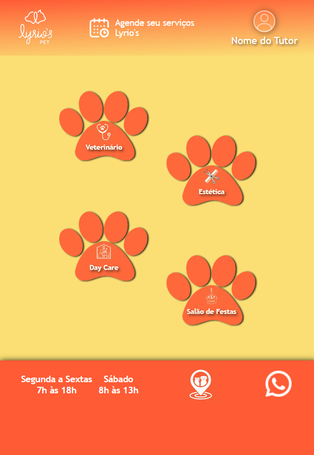
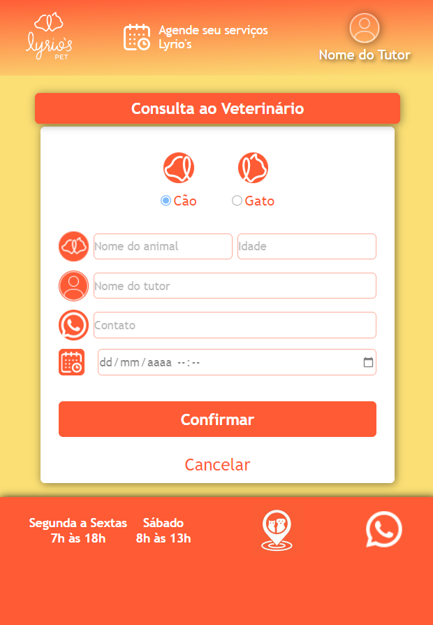
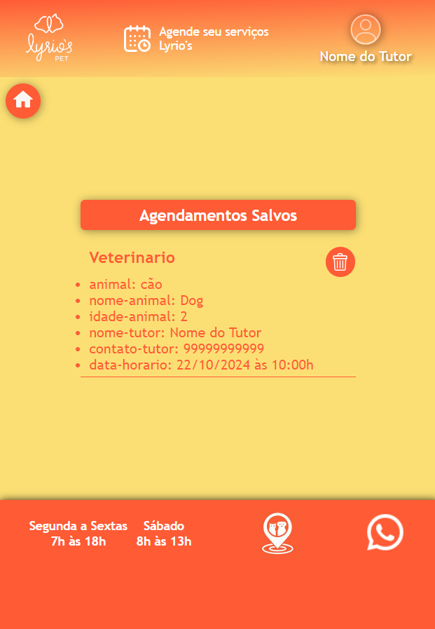

# Sistema de Agendamento

Este é um projeto de um **Sistema de Agendamento** que permite aos usuários agendar compromissos de maneira fácil e eficiente. O sistema foi desenvolvido usando tecnologias modernas, com foco em simplicidade e usabilidade.

 

   
   
   

 

***[Clik aqui e visite o APP](https://agendamento-servico-lyrios.netlify.app/)***

## Funcionalidades

- **Agendamento de datas e horários**: Permite ao usuário selecionar uma data e um horário disponível para agendar um compromisso.
- **Interface amigável**: Design intuitivo para facilitar o processo de agendamento.
- **Gerenciamento de compromissos**: Os usuários podem visualizar e gerenciar seus compromissos futuros.

## Tecnologias Utilizadas

- **HTML5**: Para a estruturação do conteúdo.
- **CSS3**: Para estilização da interface.
- **JavaScript**: Para implementação das funcionalidades e interatividade.
- **Bibliotecas adicionais** (opcional): Se você estiver usando algo como Flatpickr ou outra biblioteca, adicione aqui.

## Uso

1. Abra a aplicação e escolha a data e horário desejados no calendário.
2. Confirme o agendamento e o compromisso será salvo no sistema.

## Contribuições

Contribuições são bem-vindas! Sinta-se à vontade para fazer um fork deste repositório, implementar melhorias e abrir um pull request.

## Licença

Este projeto está licenciado sob a [MIT License](LICENSE).
