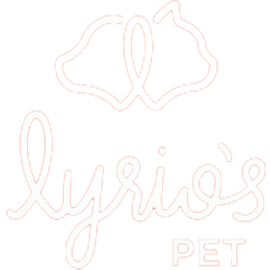

projeto 

* index.html:

<!DOCTYPE html>
<html lang="pt-BR">
<head>
<meta charset="UTF-8">
<meta name="viewport" content="width=device-width, initial-scale=1.0">
<link rel="icon" type="image/png" sizes="32x32" href="img/favicon.png">
<link rel="stylesheet" href="CSS/Style.css">
<title>Agendamento Online - Petshop</title>
</head>
<body>
<header>
    
</header>
<main>
    
</main>
<footer>
    
</footer>

</body>
</html>
1- Dentro da tag "<header>", terá 3 elementos 
(Um eleemeto com "") 
(Um elemento com "", e um texto "Agende seu serviços Lyrio's")
(Um elemento botão com ).
2- Dentro da tag "<main>" Na tela incial terá 4 botôes
Primeiro botão terá ("" e um texto "Veterinério")
Segundo botão terá ("" e um texto "Estética")
Terceiro botão terá ("" e um texto "Day Care")
Quarto botão terá (" e um texto "Salão de Festa")
3- O elemento "<footer>" terá um botão com uma ( e um 
Av. Empresário José Carlos Silva, N.º 1706 Farolandia Aracaju-Se
) onde linka para uma pagina do google maps.
**            **

* CSS/Style.css:
1- Use essas cores para estilizar o layout da forma que você achar agradável.
:root {
  --laranja: #ff5b35;
  --amarela: #fbdf74;
  --branca: #fff;
}
2- o Elemento "<header>" terá o "background: linear-gradient(898deg, #ff5b35, #fbdf74);",
posicione o "height:" das imagens e "padding:" que você achar melhor.
3- No elemnto "<main>" todo conteúdo que for mostrado dentro desse elemento, deverá esta alinhado ao centro, com um espaçamento adequandos entre eles, ajustável a qualquer tela e responsivo.
4- Os botês na tela "inicial" terá o (box-shadow: 1px 1px 10px black;), crie um "hover" agradável, e um circunferência que vc achar melhor. 
5- font-family: 'Trebuchet MS';
6- font-color: var(--branca: #fff;)
**            **

* JS/script.js:
1- Na tela inicial, no elemento "<main>" 
quando cliclado em um dos botões, sumira todos os botões e apareecerar de forma suave, de baixo para cima, um formulario alinhado ao centro.

2- Quando cliclado no primeiro botão, aparece o formulario:
Terá um titulo "Consulta ao Veterinário"
-Um chackbox com as opções onde tera uma imagem de um cão e de um gato para escolher
-Nome do animal:
-Idade:
-Nome do tutor:
-Contato: "número de telefone"
-Data e Horário:
-Um botão de confirmar abaixo: quando clicado, as informações do formulário a cima ficara salvo no navegador, será viazualizado em qualquer capo de sua escolha na tela sempre que clicado no botão "elemento botão com (), aparecerá um botão dentro do elemento "<footer>" com o icone do whatsapp ao clicado abre um dialogo com um whatsapp e será enviado para um numero de whatsapp.
-Um botão localizado no canto superior a "margin-top: 40px;" e "margin-left: 40px"; quando clicado cansela e retorna a tela inicial.

3- Quando cliclado no segundo botão, aparece o formulario:
Terá um titulo "Serviço de Estética"
-Um chackbox com as opções onde tera uma imagem de um cão e de um gato para escolher
-Nome do animal:
-Idade:
-Nome do tutor:
-Contato: "número de telefone"
-Opção de escolher (Hidratação + banho + tosa)
-Data e Horário:
-Um botão de confirmar abaixo: quando clicado, as informações do formulário a cima ficara salvo no navegador, será viazualizado em qualquer capo de sua escolha na tela sempre que clicado no botão "elemento botão com (), aparecerá um botão dentro do elemento "<footer>" com o icone do whatsapp ao clicado abre um dialogo com um whatsapp e será enviado para um numero de whatsapp.
-Um botão localizado no canto superior a "margin-top: 40px;" e "margin-left: 40px"; quando clicado cansela e retorna a tela inicial.

4- Quando cliclado no terceiro botão, aparece o formulario:
Terá um titulo "Day Care"
-Nome do animal:
-Idade:
-Opção de porte (Pequeno, Grande ou medio)
-Nome do tutor:
-Contato: "número de telefone"
-Opção de escolher (Day care + banho + tosa)
-Data e Horário:
-Um botão de confirmar abaixo: quando clicado, as informações do formulário a cima ficara salvo no navegador, será viazualizado em qualquer capo de sua escolha na tela sempre que clicado no botão "elemento botão com (), aparecerá um botão dentro do elemento "<footer>" com o icone do whatsapp ao clicado abre um dialogo com um whatsapp e será enviado para um numero de whatsapp.
-Um botão localizado no canto superior a "margin-top: 40px;" e "margin-left: 40px"; quando clicado cansela e retorna a tela inicial.

5- Quando cliclado no quarto botão, aparece o formulario:
Terá um titulo "Salão de Festa"
-Tipo de festa: com opções(Aniversário, Evento, Encontro dog e outra opção)
-Opção de porte (Pequeno + Grande + medio)
-Quatidade de cães: "número"
-Nome do Responsavel:
-Contato: "número de telefone"
-Data e Horário:
-Um botão de confirmar abaixo: quando clicado, as informações do formulário a cima ficara salvo no navegador, será viazualizado em qualquer capo de sua escolha na tela sempre que clicado no botão "elemento botão com (), aparecerá um botão dentro do elemento "<footer>" com o icone do whatsapp ao clicado abre um dialogo com um whatsapp e será enviado para um numero de whatsapp.
-Um botão localizado no canto superior a "margin-top: 40px;" e "margin-left: 40px"; quando clicado cansela e retorna a tela inicial.
**            **